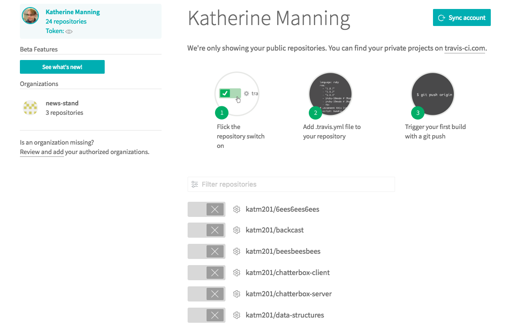
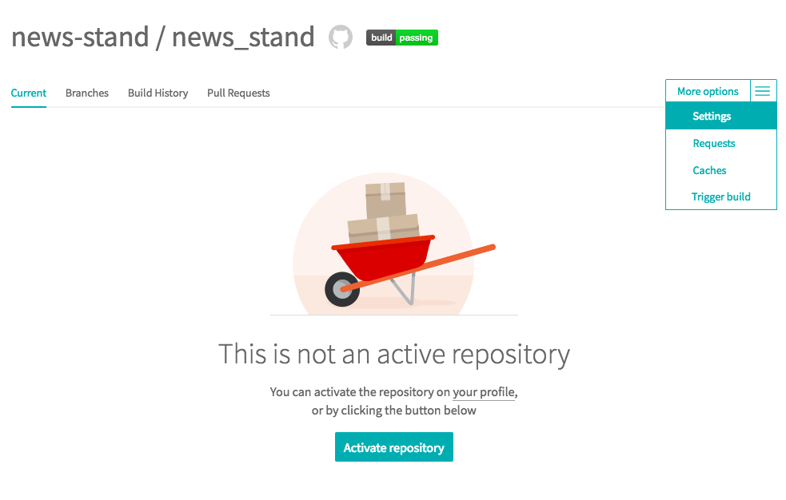
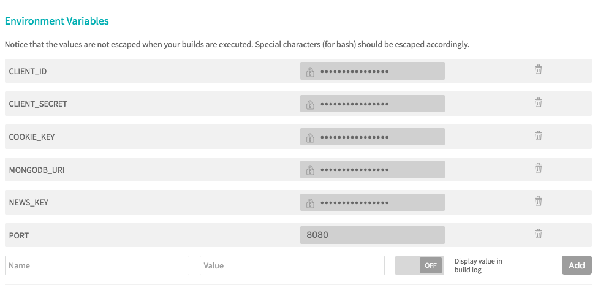
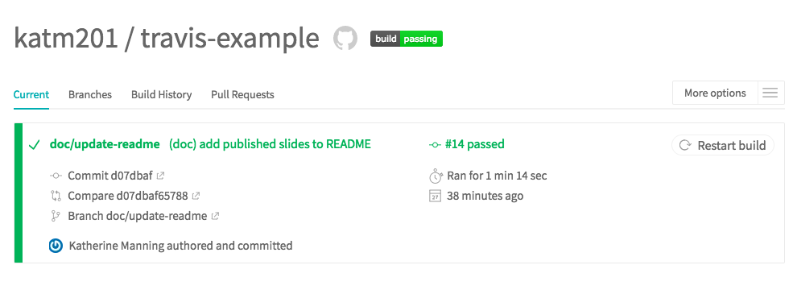
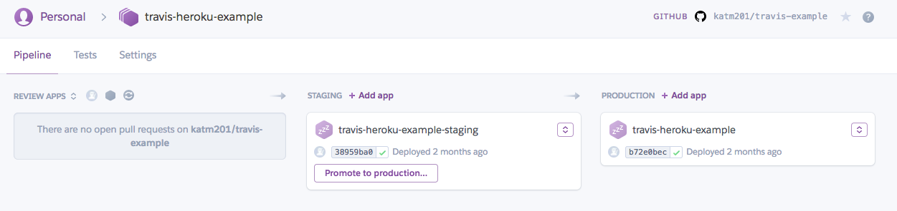
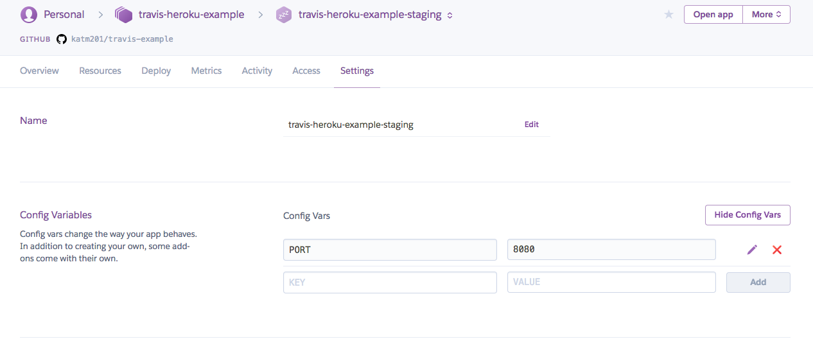
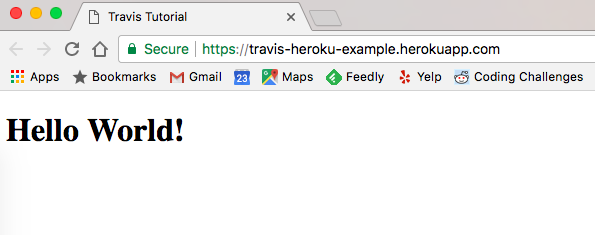

# Continuous Integration & Deployment
A quick how-to for setting up continuous integration and automatic deployment for a basic app using Travis and Heroku Pipelines

View the slide deck [here](https://docs.google.com/presentation/d/1OTlpfIIeHnGz2HDps9BKpqNzaicRKioXkQYepRmutbI/edit?usp=sharing)

## Getting Started ##

Build a basic app with a server and at least one test (nothing fancy necessary). I have a basic "Hello World" app with a client and server in the app folder that you can reference. It's super simple, but it demonstrates setting up Webpack for React.

## Set Up Travis ##

Create a new public repo on Github for your project. Next, sign up for an account using your Github credentials at [Travis-CI.org](https://travis-ci.org/), if you don't already have one. Once you’ve logged in, go to your account page and give Travis permission to access your repo.



Next, you'll need to configure Travis with a .yml file. Add .travis.yml to your root directory by executing the following command:

```sh
touch .travis.yml
```

Open the file and add the language that your app is written in:

```yml
language: node_js
```

Commit the change and push it up to Github. This will trigger your first Travis build. This build will *fail*--feel free to preempt that by cancelling the build.

### Environment Variables ###

Before going any further, let's talk about environment variables. Environment variables are a great place to keep protected or build-specific information: ports, API keys, database location (local or web hosted), etc.

Once you’ve started (and failed/cancelled) your first build, you can add your environment variables to the settings page for your repo on Travis.

Go into the repo's settings:



Then add any environment variables that you have for your repo:



Travis allows you to add both unsecured and unsecured environment variables for your repo. As a security measure, however, Travis will *not* allow you to use secured environment variables across repos, like if you're doing a pull request between forks. 

*If you want to use secured environment variables, they'll only work on branch updates or pull requests between branches on the same repo.*

### What Does Travis Actually Do? ###

Travis is a Linux virtual machine that's downloading your repo, installing it for the first time, then trying to run your "npm run test" script. This means that we need to specify everything about the environment in our .travis.yml file that's necessary for our npm modules to install and our server to spin up or else it will continue to fail. This includes (but isn't limited to) language version, build scripts, other global installations or addons (like Chrome for Karma tests, Postgres database, etc.).

Think of Travis like a new team member who's downloading and working on the repo for the first time. Every instruction that she'd need is one that Travis needs.

### The Config File ###

You can customize your build to do certain jobs before your test script runs, like install Chrome or run your build script. You can also tell it to run a custom test script beyond the default “npm run test”. If your “npm run test” script requires that your server be already running, you’ll need to specify that to Travis also.

For example:
```yml
language: node_js
node_js:
- 8.4.0
before_script:
- npm run build:prod
script: node ./build/server/index.js & npm run test
```

Once you have all of these pieces specified for Travis, you should get a passing build.



If all you're looking for is continuous integration for testing, then you're done! 

## Deployment ##

You have a working app with passing tests, but it only runs on your local machine. Time to share it with the world! Heroku is a hosting service that you can deploy to--it has a tool called Pipelines that lets you keep separate Staging and Production versions of your app. This lets you test new builds without breaking your public version of the app.

### Heroku Installation & Setup ###

Download and globally install both the Heroku Toolbelt and the Travis CI Client onto your local machine.

From your your root directory, run execute:

```sh
heroku login
```

Heroku will prompt you to enter your credentials.

Next, run:
```sh
heroku create <app_name>
```

Heroku will let you know if the name you’ve requested is available. Your app will then appear in your Heroku account.

### Create Pipeline ###

In your Heroku account, click on your new app. This will take you to your app’s control page. Select the “Add to Pipeline”, then follow the prompts to set up your pipeline.

Decide if you want the current app to be your Staging or Production version, then hit “Create”. For the purposes of this tutorial, we’re going to choose Production.

On your Pipeline’s control page, click the button to create a Staging version of your app. This is the version we’re going to hook up to Travis for automatic deployment. If we like what we’ve built and everything seems solid, we can promote our Staging app to Production manually.

Pipeline Dashboard:


### Review Apps ###

Heroku review apps allow us to view potential changes coming in from pull requests. Heroku automatically deploys from the pull request and then deletes the app once the pull request has been closed or merged. First, go to your Pipeline’s settings page and connect to your Github repo. Then, go back to your Pipeline’s control page and select “Enable Review Apps”.

Select which app you want the review apps to inherit their environment from (Staging, ideally). Hit the “Create an app.json File” button and follow the prompts. You’ll be able to see the output at the bottom and there’s a button to add it to your Github repo.

A pull request will now automatically trigger a build for a review app.

### Environment Variables ###

Heroku requires that you set your environment variables separately for each app in the pipeline (similar interface as with Travis). This allows you to connect a separate “testing” database or API key to your Staging app than what’s running for Production. You need to set your review apps to inherit your environment variables from Staging. *DO NOT* set them in your app.json, as that’s publically committed to Github.



### Manual Deployment ###

Once everything is setup, you’ll want to do a manual deploy to your Staging or Production app. We want to make sure everything is working before we set up auto deployment.

Click on the app you want to deploy, then click on the “Deploy” menu. Scroll to the bottom, select the branch on Github you want to deploy from, then hit “Deploy Branch”. Once complete, you’ll be able to view your deployed app!



### Auto Deployment ###

In your terminal, execute:

```sh
travis setup heroku
```

Follow the prompts to tell Travis which repo to deploy to Heroku from.

Make sure you tell Travis to encrypt your Heroku API key! Your .travis.yml file is in your public Github repo, so it should *always* be kept encrypted.

Open up your .travis.yml file to see the changes. There is now a section telling Travis how to auto deploy your app. One change, however--make sure you update the app it’s deploying to. It starts out with your Production app, but you’ll want it to go to your staging app. It provides a secure hash of your API key for security.

Example Output:
```yml
language: node_js
node_js:
- 8.4.0
before_script:
- npm run build:prod
script: node ./build/server/index.js & npm run test
deploy:
  provider: heroku
  api_key:
    secure: Vu44G5zushb9zwxaJfrd2U7nawgX6dve7wcPA3JV9VoQe7BcYk9dPgUF3EVSTTNqiOf0q2bsZE1WerDYr2XDlqOYr+1e9IbLI4BF5Poz6RwAACW3UpE/CudhzXr3SlZazEBIDY5XrM6Bfz5rgzWB7hta4/7GOb/Mjx4RJDvbiipVLJAJvIIYPxdFhleqXMMgfwrkcuu5oJqV7jIH3uRUBeByM/JtN/CZIdx6+5YqeBRTgHOuAyyhpoLal2WMkdz/xh/s5eGIaoTgrIzJxg5a+vWzt+MtgYVpeGAbIHQMfmSf761NNHKBgiigBEQYBiqO36fHuLvoPfRz/oLBC0BbuCpXtBcKJvVW2YenaIVTPlkbSRb8YMrduD54BExlaoQTsftec4U4Vd/iS6P/TN2pJw3GOFeRWXHQgB35IVRB/uDR1dVyeX3e4F5Dgv6wBObTug1/0g45jLmjQEW9nz13XMWDt96WNQhU3VWxQOIEhIUi3t5JKnSTYL9Of0wsWIGiFIaw8puBdsJP0EQp7RCPEDoDMcV3OaNWdh+rZjQqtHaH5KM3ux3XSzfQc4yc4l
  app: travis-heroku-example-staging
  on:
    repo: katm201/travis-example
```

Complete auto deployment by committing the changes to your .travis.yml file and push up to your Github repo. If you’re submitting a pull request to the master branch, Travis will run a build on the request to make sure it passes all tests.

Once you merge (or if you just submit to master to begin with), Travis will run its checks again, then deploy to your Staging app on Heroku if everything passes.

## Key Takeaways ##

- Start setting up Travis and Heroku early on--it’s easier to troubleshoot issues with a simple project and add on from there
- A Travis container is basically just a blank Linux machine, so give it the information it needs to set itself up, as if it were a new team member
- Environment variables--know how to use and set them
- Git workflow can affect what variables Travis has access to, so put thought into the choices you make
